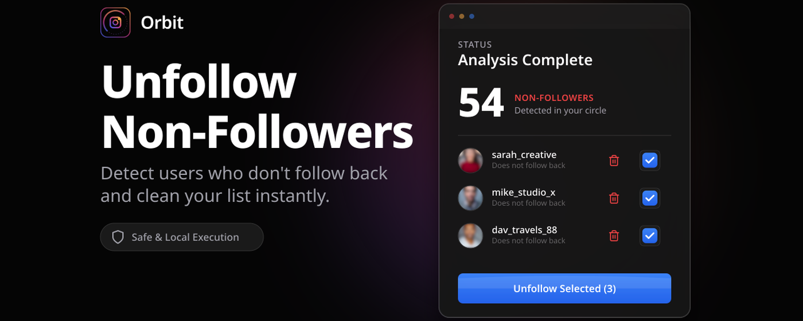
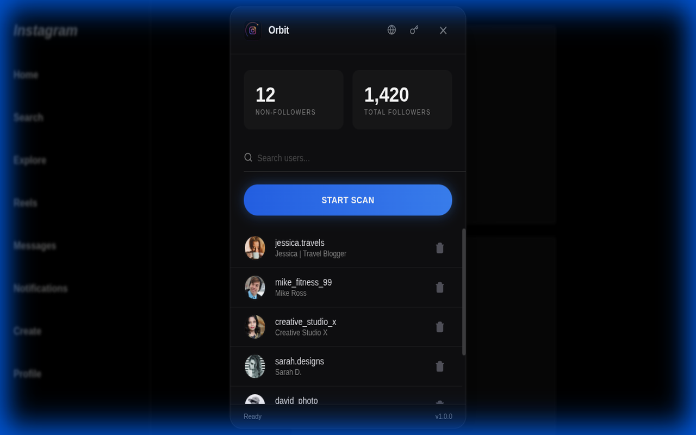
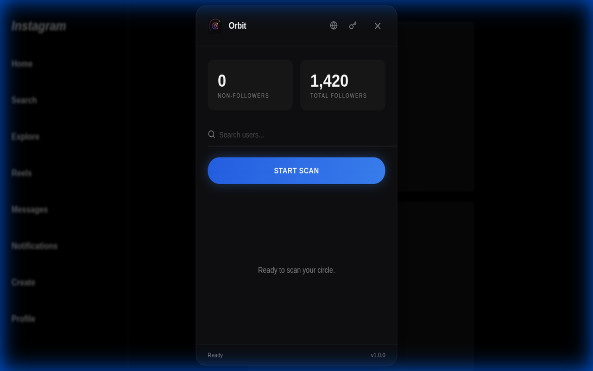

# Orbit Tools - Social Circle Visualizer

Visualize your social circle and manage your Instagram connections with ease.

## ✨ Features
- **Visualize Connections:** See who follows you back and who doesn't.
- **Manage Unfollows:** Identify and manage your social circle efficiently.
- **Secure:** Runs locally in your browser.

## 🛠️ Tech Stack
- **Core:** JavaScript (Chrome Extension Manifest V3)
- **UI:** HTML/CSS
- **Build:** Webpack/Custom Scripts

## 📸 Screenshots

  
  

## 🔗 Links
- [Chrome Web Store](https://chromewebstore.google.com/detail/orbit-social-circle-visua/moclhlflhkomlechhdbcjedjlpocgppg?authuser=8&hl=en)
- [Website Repository](https://github.com/tomasoliveirz/orbit-tools-website)
